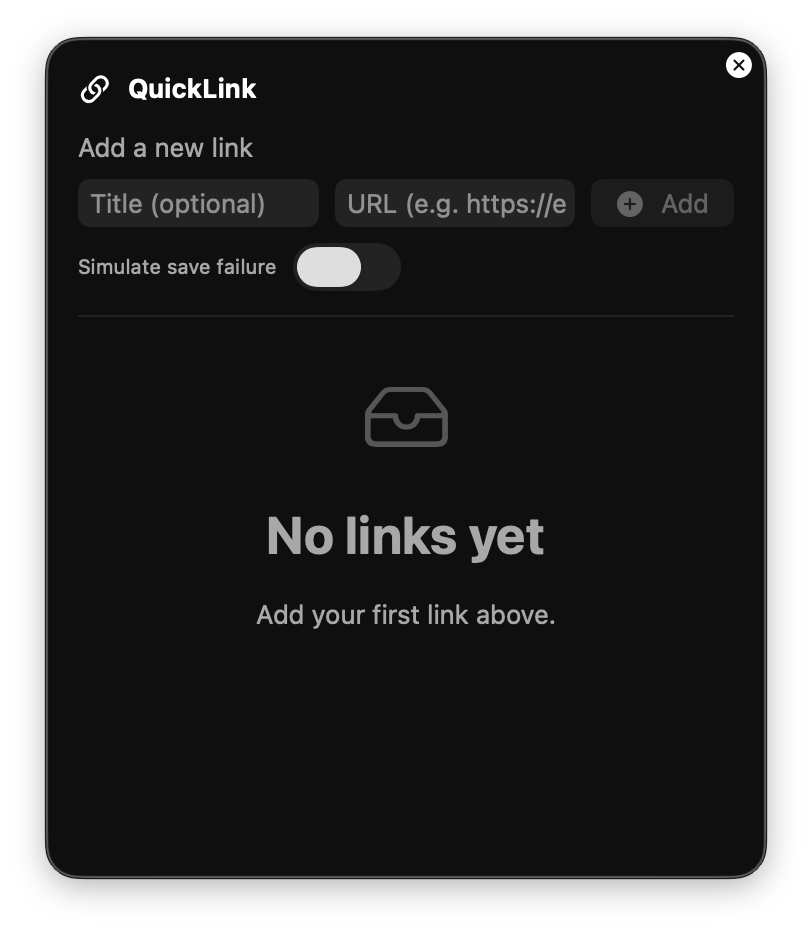
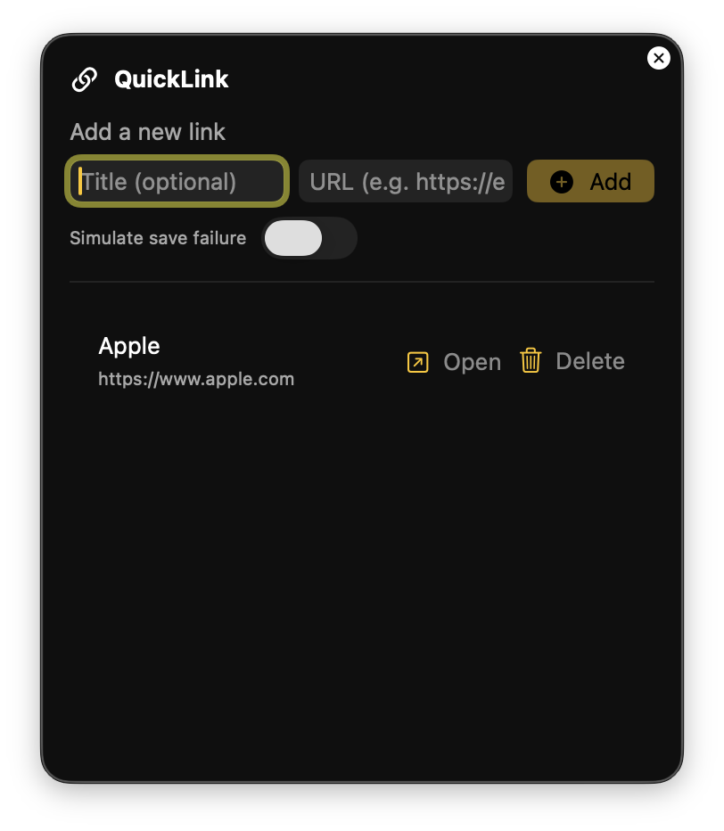

# QuickLink

A minimal macOS Menu Bar utility built with SwiftUI `MenuBarExtra` to quickly add and open links.

## Features
- Add links with optional title and URL normalization (auto-prepend https://)
- Open links via SwiftUI `openURL` (default browser)
- Delete links (button or swipe-to-delete)
- Persistence via `UserDefaults` (JSON encoded)
- Inline error message for failed saves (Debug can simulate failures)
- Menu bar window style with in-window Quit button

## Getting Started
1) Open the project in Xcode and run the `QuickLink` scheme on “My Mac”.
2) Click the menu bar icon and add links:
   - Title is optional. When empty, the URL is shown as the primary label.
   - `https://` is auto-prepended if the scheme is missing.
3) Use “Open” to launch a link in your default browser. Delete via the trash button or swipe-to-delete.

### Debug save-failure simulation
- Toggle “Simulate save failure” (visible in Debug builds) to show the inline error and rollback changes.

## Hide Dock Icon
For a menu-bar-only experience, set the app as an agent so it doesn’t appear in the Dock or app switcher.

1. Open your target > Info tab.
2. Add key: Application is agent (UIElement) (LSUIElement) and set value to YES.

## Screenshots & Demo

| Type | Preview |
| --- | --- |
| Demo | <video src="https://github.com/carterTsai95/QuickLink/blob/main/QuickLink/Media/Action.mov" width="320" height="240" controls></video> |
| Empty list |  |
| Item row |  |

## Roadmap (Next)
- Search/filter, sorting, and pinning
- Link groups (folders) and drag-to-reorder
- Keyboard shortcuts (quick add / open Nth link)

## References
- Build a macOS menu bar utility in SwiftUI — [nilcoalescing.com](https://nilcoalescing.com/blog/BuildAMacOSMenuBarUtilityInSwiftUI/)
- Create a mac menu bar app in SwiftUI with MenuBarExtra — [sarunw.com](https://sarunw.com/posts/swiftui-menu-bar-app/)
